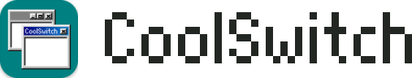

# good-vibes

A collection of my vibe coded projects that are polished enough to release.

Although used often, these projects are not tested outside of the latest version of macOS/Chrome/Safari.

All `README`s are guaranteed organic, pasture-raised human writing.

### <picture><source media="(prefers-color-scheme: dark)" srcset="skeinfiend/docs/logo-dark.svg"></picture>

Colorwork chart designer for knitters, with WebMCP support for bring-your-own-agent assisted projects.

[skeinfiend.com](https://skeinfiend.com) · [README](skeinfiend/)

### <picture><source media="(prefers-color-scheme: dark)" srcset="coolswitch/packaging/logo-dark.svg"></picture>

Command-Tab between windows and tabs on macOS.

[Download](https://github.com/evanbunnage/good-vibes/releases/download/coolswitch-latest/CoolSwitch.zip) · [README](coolswitch/)

