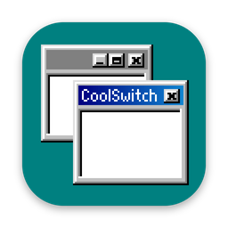

# CoolSwitch

Command-Tab between windows on macOS. Supports apps that use native tabs like [Ghostty](https://ghostty.org).

## How is this different from AltTab?

[AltTab](https://alt-tab.app/) is great if you want more features like window previews and deep customizability. Go check it out!

CoolSwitch remains a more lightweight alternative for users who simply want the core alt-tab behavior from Windows.

## Install

**[Download CoolSwitch.zip](https://github.com/evanbunnage/good-vibes/releases/download/coolswitch-latest/CoolSwitch.zip)**, unzip it, and open **CoolSwitch.app**.

## Using CoolSwitch

- Hold ⌘ and press Tab to view open windows.
- While holding ⌘, press Shift to move backward in the list.
- Release ⌘ (or press Return) to switch the window. Press Escape to cancel.

Supports arrow key navigation, native tabs, minimized windows and apps with no open windows.

**Settings:** reopen CoolSwitch to view the settings page.

## Updating

Download the latest `CoolSwitch.zip` and open the new **CoolSwitch.app**. Choose **Update**.

## Uninstalling

- Quit the app and move it to the Trash.
- To remove its Accessibility entry, go to System Settings → Privacy & Security → Accessibility, select CoolSwitch, and click `−`.

## Privacy

CoolSwitch uses its permissions to read window titles, handle ⌘Tab, and focus windows. The app makes no network requests, collects no analytics, and doesn't take screenshots.

## Why "CoolSwitch"?

Windows 3.1's Alt-Tab implementation internally was known as [CoolSwitch](https://en.wikipedia.org/wiki/Alt-Tab#History)!

## Build from source

Requires Xcode 26 or newer.

```sh
swift test
./scripts/build-app.sh
open dist/CoolSwitch.app
```

Regenerate the icon with `uv run packaging/make-icon.py`.

## Release

```sh
gh workflow run coolswitch.yml --repo evanbunnage/good-vibes --ref main -f version=X.Y.Z
```

## Acknowledgments
- [AltTab](https://github.com/lwouis/alt-tab-macos) for paving the way
- [permiso](https://github.com/zats/permiso) for the nice Codex-like onboarding

## License

[MIT](LICENSE)
